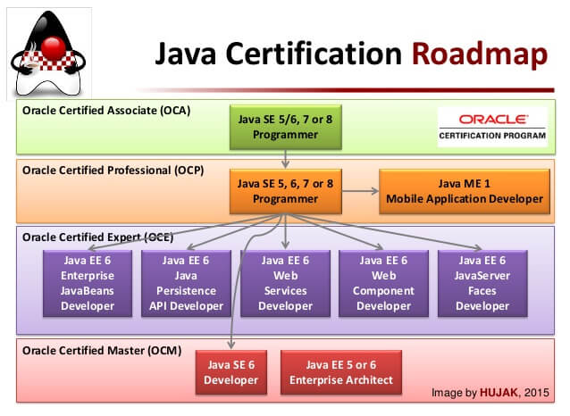
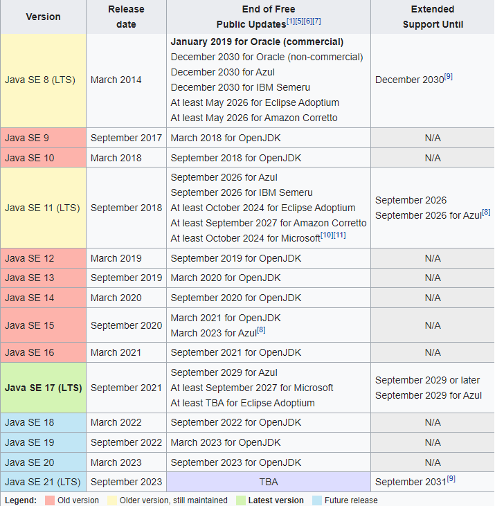
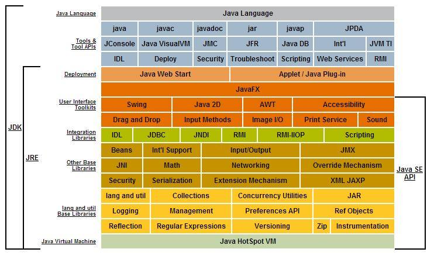
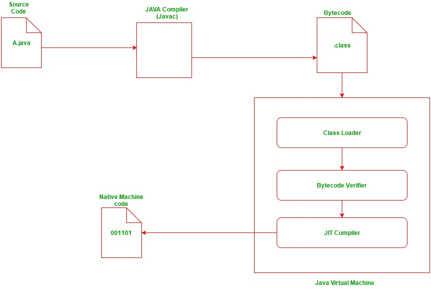
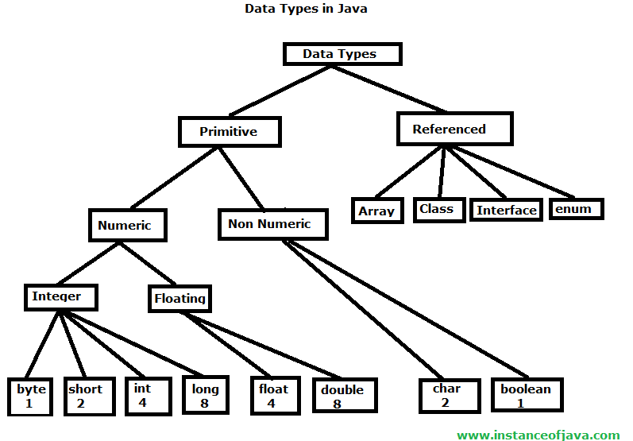
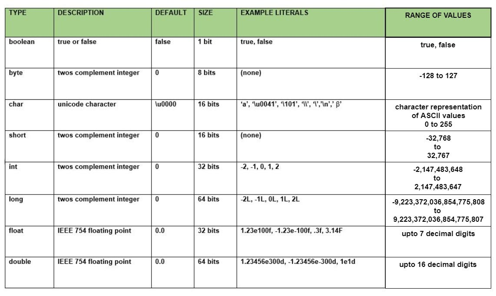
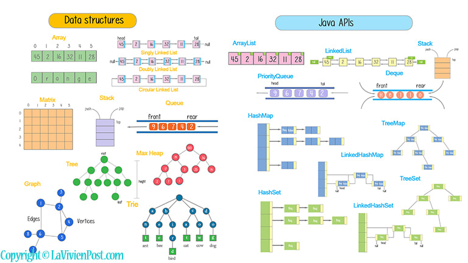

# JAVA Documentation

## Table of Contents

1. [Basic Java](#1-basic-java)

   - [Introduction to Java](#11-introduction-to-java)
   - [First Java Application](#12-first-java-application)
   - [Escape sequences](#13-escape-sequences--backslash-characters)
   - [Types of Comments](#14-types-of-comments)
   - [Java program's Phases](#15-java-programs-phases)
   - [Variable & Data types](#16-variable--data-types)
   - [Format specifiers](#17-format-specifiers)
   - [Getting user inputs](#18-getting-user-input)
   - [Operators, Operands, Expression](#19-operators-operands-expression)
   - [Control Statement](#110-control-statements)
     - [Conditional control statement](#1101-conditional-control-statements)
     - [Loop control statement](#1102-looping-control-statements)
     - [Jump control statement](#1103-jump-control-statements)
   - [Control Statement2](#110-control-statements)
   - [Control Statement2]()

2. Intermediate
3. All assignments

   - [Assignment 1 (Print User Information)](#assigment-1-print-your-information)
   - [Assignment 2 (Variable and Data type)](#assignment-2-variable-and-data-type)
   - [Assignment 3 (User Input)](#assignment-3-user-input)
   - [Assignment 4 (installment amount for per month)](#assignment-4-installment-amount-for-per-month)
   - [Assignment 5 (valid voter using if else)](#assignment-5-valid-voter-using-if-else)
   - [Assignment 6 (Digit spelling using if else)](#assignment-6-digit-spelling-using-if-else)
   - [Assignment 7 (logical OR operators and if else)](#assignment-7-logical-operators-and-if-else)
   - [Assignment 8 (Logical AND assignment and if-else)](#assignment-8-logical-and-assignment-and-if-else)
   - [Assignment 9 (Call center using switch)](#assignment-9-call-center-using-switch)
   - [Assignment 10 (find sum of 1-10 using for loop)](#assignment-10-find-sum-of-1-10-using-for-loop)
   - [Assignment 11 (find factorial of n)](#assignment-11-find-factorial-of-n)
   - [Assignment 12 (print sum of odd numbers from m-n)](#assignment-12-print-sum-of-odd-numbers-from-m-n)
   - [Assignment 13 (find nth fibonacci number)](#assignment-13-find-nth-fibonacci-number)
   - [Assignment 14 (Palindrome number)](#assignment-14-palindrome-number)
   - [Assignment 15 (Armstrong number)](#assignment-15-armstrong-number)
   - [Assignment 16 (find nth fibonacci number)](#assignment-16---find-nth-fibonacci-number)
   - [Assignment 17 (Pattern program)](#assignment-17-pattern-program)
   - [Assignment 18 (Print the day name)](#assignment-18-print-the-day-name)

## Programs

- Operators

  - calculator programs - area, temperature
  - days to time converter program: 10 days = seconds?

- Control statement

  - conditional control statement: if, else if, else, switch
    - Even/odd program
    - Pass/Fail program
    - valid voter program
    - Positive/Negative/Zero program
    - Digit spelling program
    - Large/small program
    - Leap year program
    - Vowel/Consonant program
    - small/capital letter
    - assignments
  - Loop control statement: for, while, do while
  - Jump control statement: break, continue, return

    - print 1-100 using for, while, do while loop
    - print a-z
    - print 2,4,...100 / even numbers from 1-100
    - print 1,3,...99 / odd numbers from 1-100
    - print sum of 1-n numbers
    - print sum of even numbers from 1-100
    - print sum of odd numbers from 1-100
    - factorial of n
    - series related program: 1+2+3+ ... + n
    - series related program: 1^2+2^2+3^2+ ... + n^2
    - Fibonacci series
    - multiplication table
    - nested related problems
    - prime numbers
    - prime numbers from 1 to n
    - sum of digits
    - reverse a number
    - palindrome number
    - Armstrong number
    - user is valid or not by checking username,password
    - Pattern related program

- Data structure
  - Array
    - introduction to array
    - sum and average
    - maximum and minimum
    - for each in array
    - 2d array
    - array matrix
    - sum of diagonal, upper triangle, lower triangle elements of a matrix
    - array output test
    - array sorting
  - ArrayList
  - LinkedList
  - HashMap
  - HashSet
- String
  - String
  - StringBuffer
  - StringBuilder
- Date & Time

## 1. Basic Java

### 1.1 Introduction to Java

- What is Java?
  - Java is a high level; OOP (Object Oriented Programming) language originally developed by sun microsystem but currenly owned by Oracle.
- Why Should we learn Java / Features of Java?
  - Platform Independent - WORA (Write Once Run Anywhere)
  - Object Oriented
  - Support web based application
  - Robust (example - exception handling)
  - Multi-threaded
- What does platform independent means?
  - Test.java -> javac -> Test.class (ByteCode) -> Any JVM in any OS can run the ByteCode
- History of Java
  - C++ was not platform independent and could not support netwrok programming so sun microsystem took a project called "green project" in 1990 to sort out this issue.
  - James Gosling (Father of Java), Patrick Naughton and Mike Sheridan was working in this project.
  - At first it was names as Oak programming language but in 1994 they named it as Java.
  - Java was officially released in 1995.
- Java Certifications
  
  
- Java Versions
  
- Environment Setup

  - JDK: Java Development Kit is a software development environment used for developinh java applications and applets. It includes Java Runtimne Environment (JRE), an interpreter / loader (java), a compiler (javac), a document generator (javadoc) and other toold needed in java development. Check JDK is installed or not by using this command `java -version` in your terminal
    
  - IDE: Integrated Development Environment. An Integrated Development Environment (IDE) is a software application that provides comprehensive tools and features to facilitate software development. Examples of IDE's: Eclipse, NetBeans, Visual Studio Code, JDeveloper, IntelliJ IDEA, Programiz Java Compiler. Here are some reasons why developers use IDEs:

    1. Code Editing: IDEs offer advanced code editing capabilities such as syntax highlighting, code completion, and error checking. These features help developers write code more efficiently and with fewer mistakes.

    2. Debugging: IDEs provide debugging tools that allow developers to step through their code, set breakpoints, and inspect variables. Debugging tools help identify and fix issues in the code during development.

    3. Build and Compilation: IDEs integrate with build systems and compilers, making it easier to build, compile, and run the code. They can automate repetitive tasks such as compiling, packaging, and deploying the application.

    4. Project Management: IDEs provide project management features that help organize and manage code files, libraries, and resources. They offer features like code navigation, search, and refactoring tools, making it easier to work with large codebases.

    5. Version Control Integration: IDEs often have built-in support for version control systems like Git. They provide features to commit, update, and manage code changes, making collaboration with other developers smoother.

    6. Code Templates and Snippets: IDEs offer code templates and snippets that help speed up development by providing predefined code structures or commonly used code snippets.

    7. Testing and Profiling: IDEs may include tools for writing and running tests, as well as performance profiling to identify bottlenecks in the code and optimize performance.

    8. Integration with Frameworks and Libraries: Many IDEs provide integration with popular frameworks and libraries, offering features like code generation, automated configuration, and easy access to documentation.

### 1.2 First Java Application

- File Extension .java
- Every java application must have a class. class name must start with a capital letter.
- A package is a folder which holds collection of classes and interfaces. package names are typically written in lowercase letters.

```java

// A program to print your info
// Understand the program flow
// keywords in Java - Keywords are reserved words and also in small letters
// How to create a class, function
// How to print in Java - use System.out.Println() or print()
// what is string? printing string in quotation
// printing numeric value does not require double quotation
class Program1 {
  public static void main(String[] args) {
    System.out.print("Product Infos");
    System.out.println("Product: iphone 14");
    System.out.println("Price: $1300");
    System.out.println("Quantity: 14");
  }
}
```

#### Assigment 1 (print your information)

### 1.3 Escape sequences / Backslash characters

```java
// Escape sequence - a special character followed by backslash. sometimes it is called as backshalsh character
// example -> \b, \t, \n, \", \', \\

class Test {
  public static void main(String[] args) {
    System.out.print("\"Product Infos\"\n");
    System.out.println("Product:\t iphone 14");
    System.out.println("Price:\t\t $1300");
    System.out.println("Quantity:\t 14");
  }
}
```

### 1.4 Types of Comments

- Comments are used to add explanatory notes or annotations within the source code. It is good practice to add meaningful comments to your code to enhance its understandability and maintainability. Comments can help you and other developers understand the purpose of the code, clarify complex logic, or provide reminders for future modifications.
  Java supports three types of comments:

  1. Single-line comments: Single-line comments begin with two forward slashes (`//`) and extend to the end of the line. They are used for short comments or explanations on a single line.

  ```java
  // This is a single-line comment
  int age = 25; // Variable representing the age
  ```

  2. Multi-line comments: Multi-line comments, also known as block comments, begin with a forward slash followed by an asterisk (`/*`) and end with an asterisk followed by a forward slash (`*/`). They can span multiple lines and are often used for longer explanations or comment blocks.

  ```java
  /*
  This is a multi-line comment
  It can span multiple lines
  Used for longer explanations or comment blocks
  */
  ```

  3. Javadoc comments: Javadoc comments are a special type of comment used for generating documentation from the source code. They begin with a forward slash followed by two asterisks (`/**`) and end with an asterisk followed by a forward slash (`*/`). Javadoc comments are used to describe classes, methods, and fields and can include tags for specifying parameters, return values, exceptions, and more.

  ```java
  /**
    * This is a Javadoc comment.
    * It can be used to generate documentation.
    * @param name the name of the person
    * @return a greeting message
    */
  public String greet(String name) {
      return "Hello, " + name + "!";
  }
  ```

### 1.5 Java program's Phases

- Edit -> Compile -> Load -> Verify -> Execute
  

### 1.6 Variable & Data types

- A variable is a container for storing data. When declaring variables in Java, there are certain rules and conventions to follow. syntax: data-type variable-name;
  Here are the key rules for variable declarations:

1. Variable Names:

   - Must start with a letter, underscore (\_), or dollar sign ($).
   - Can include letters, digits, underscores, and dollar signs.
   - Cannot be a reserved word (e.g., keywords like "int", "class", "public").
   - Follow camelCase convention (start with a lowercase letter, capitalize each subsequent word).

2. Variable Types:
   
   
   
3. Initialization:

   - Variables can be initialized at the time of declaration or later in the code.
   - Uninitialized local variables cannot be used until they are assigned a value.

4. Scope:

   - Variables have different scopes, such as local scope, method scope, or class scope.
   - Local variables are declared within a block of code and are only accessible within that block.
   - Class variables (also known as static variables) are shared across instances of a class.
   - Instance variables belong to a specific instance of a class.

5. Constants:

   - Constants are declared using the `final` keyword to indicate that their value cannot be changed.
   - Constant variable names are typically written in uppercase with underscores for word separation (e.g., final int MAX_VALUE = 100).

6. Naming Conventions:

   - Use meaningful and descriptive names for variables.
   - Follow camelCase convention for variable names (e.g., firstName, numItems).
   - Avoid using single-character variable names (except for loop counters or temporary variables).
   - Choose names that are easy to understand and maintain.

7. Declaration and Assignment:
   - Declare variables before using them in the code.
   - Variables should be assigned values appropriate to their data type.
   - Variables can be assigned new values using the assignment operator (=).

Here's an example that illustrates these rules:

```java
class Test {
  public static void main(String[] args) {
    String productName = "iphone 14";
    double productPrice = 1300;
    int productQuantity = 14;
    final double PRODUCT_DISCOUNT = 10.133;
    System.out.println("Product Infos");
    System.out.println("Product:  " + productName);
    System.out.println("Price: $" + productPrice);
    System.out.println("Quantity: " + productQuantity);
    System.out.println("Discount: " + PRODUCT_DISCOUNT);
  }
}

/*
 * Learning outcomes
 * variable declaration
 * variable initalization
 * dynamic initialization
 * data types
 */
public class Program4 {
  public static void main(String[] args) {

    // declaring variables for a student
    String name;
    int id, age;
    double gpa;
    boolean isRegisted;

    // initializing variables for a student
    name = "Anisul Islam";
    id = 1302020017;
    age = 25;
    gpa = 3.92;
    isRegisted = true;

    // printing variables
    System.out.println("Student Information");
    System.out.println("--------------------");
    System.out.println("Name: "+name);
    System.out.println("ID: "+id);
    System.out.println("Age: "+age);
    System.out.println("GPA: "+gpa);
    System.out.println("Registered: "+isRegisted);
  }
}
```

By following these rules and conventions, you can write clean, readable, and maintainable code in Java.

#### Assignment-2 (Variable and Data type)

```java
  /*
  * Assignment-2 (Variable and Data type)
  * step 1: create a class called Product
  * step 2: create a main method
  * step 3: declare variables: id, title, price, description, category
  * step 4: assign the following data in main method
  101,iphone15,1895 euros,perfect product with best image quality, phone,
  * step 5: print the data
*/
```

### 1.7 Format specifiers

- Format specifiers in Java are used to control the formatting of values when outputting them using methods like System.out.printf() or String.format(). They provide a way to specify how a value should be displayed, including its width, precision, alignment, and data type.

```java
/*
 * Learning outcomes
 * format specifiers
 */
public class Program5 {
  public static void main(String[] args) {

    // declaring variables for a student
    String name;
    int id, age;
    double gpa;
    boolean isRegisted;

    // initializing variables for a student
    name = "Anisul Islam";
    id = 1302020017;
    age = 25;
    gpa = 3.92;
    isRegisted = true;

    // printing variables
    System.out.println("Student Information");
    System.out.println("--------------------");
    System.out.printf("Name: "+name);
    System.out.printf("Name: %s\n",name);
    System.out.printf("ID : %d: \n",id);
    System.out.printf("Age: %d\n",age);
    System.out.printf("GPA: %.2f\n",gpa);
    System.out.printf("Registered: %b\n",isRegisted);
  }
}
```

### 1.8 Getting User Input

```java
import java.util.Scanner;

class Test {
  public static void main(String[] args) {
    try (Scanner input = new Scanner(System.in)) {
      // String productName = input.next(); // does not count anything after space
      System.out.print("Enter Product Name: ");
      String productName = input.nextLine();

      System.out.print("Enter Product Price: ");
      double productPrice = input.nextDouble();

      System.out.print("Enter Product Quantity: ");
      int productQuantity = input.nextInt();

      final double PRODUCT_DISCOUNT = 10.133;
      System.out.println("Product Infos");
      System.out.println("Product:  " + productName);
      System.out.println("Price: $" + productPrice);
      System.out.println("Quantity: " + productQuantity);
      System.out.println("Discount: " + PRODUCT_DISCOUNT);
    }
  }
}

/*
Learning outcome
how to get user input
Read a byte - nextByte()
Read a short - nextShort()
Read an int - nextInt()
Read a long - nextLong()
Read a float - nextFloat()
Read a double - nextDouble()
Read a boolean - nextBoolean()
Read a complete line - nextLine()
Read a word - next()
 */
import java.util.Scanner;

public class Program6 {
  public static void main(String[] args) {
    Scanner input = new Scanner(System.in);

    // declaring variables for a student
    String name;
    int id, age;
    double gpa;
    boolean isRegisted;

    // getting inputs for a student
    System.out.print("Enter student name: ");
    name = input.nextLine();

    System.out.print("Enter student id: ");
    id =  input.nextInt();

    System.out.print("Enter student age: ");
    age =  input.nextInt();

    System.out.print("Enter student gpa: ");
    gpa =  input.nextDouble();

    System.out.print("Enter student is isregistered? true/false : ");
    isRegisted =  input.nextBoolean();

    // printing variables
    System.out.println("Student Information");
    System.out.println("--------------------");
    System.out.println("Name: "+name);
    System.out.println("ID: "+id);
    System.out.println("Age: "+age);
    System.out.println("GPA: "+gpa);
    System.out.println("Registered: "+isRegisted);
  }
}
```

#### Assignment-3 (User Input)

```java
/*
 * Assignment-3 (User Input)
 * step 1: create a class called Product
 * step 2: create a main method
 * step 3: declare variables: id, title, price, description, category
 * step 4: get user input for each variables
* step 5: print the variables
 */

```

### 1.9 Operators, Operands, Expression

- In Java, operators are symbols or characters that perform specific operations on operands (variables, literals, or expressions). They are used to manipulate and process data within expressions and statements. Here are the different types of operators in Java:

1. Arithmetic Operators:

   - Addition: `+`
   - Subtraction: `-`
   - Multiplication: `*`
   - Division: `/`
   - Modulus (remainder): `%`
   - Increment: `++`
   - Decrement: `--`

   ```java
   // Example of Arithmetic operators
   import java.util.Scanner;

   public class Program7 {
     public static void main(String[] args) {
       int number1, number2, result;
       Scanner input = new Scanner(System.in);

       System.out.print("number1 = ");
       number1 = input.nextInt();
       System.out.print("number2 = ");
       number2 = input.nextInt();

       result = number1 + number2;
       System.out.println(number1 +" + "+number2 + " = "+result);

       result = number1 - number2;
       System.out.println(number1 +" - "+number2 + " = "+result);

       result = number1 * number2;
       System.out.println(number1 +" * "+number2 + " = "+result);

       // type casting
       double result2 = (double)number1 / number2;
       System.out.println(number1 +" / "+number2 + " = "+result2);

       result = number1 % number2;
       System.out.println(number1 +" % "+number2 + " = "+result);

     }
   }
   ```

   ```java
      // Example of Unary Operators
     /*
     * Unary Operator
     * Unary Plus, minus
     * increment -> prefix increment, postfix increment
     * decrement -> prefix decrement, postfix decrement
     */
     public class Program10 {
       public static void main(String[] args) {
         int x = 10;
         System.out.println(+x);
         System.out.println(-x);
         System.out.println(x++);
         System.out.println(++x);
         System.out.println(x);
         System.out.println(x--);
         System.out.println(--x);
       }
     }

   ```

2. Assignment Operators:

   - Assignment: `=`
   - Addition assignment: `+=`
   - Subtraction assignment: `-=`
   - Multiplication assignment: `*=`
   - Division assignment: `/=`
   - Modulus assignment: `%=`

   ```java
   // Example of Assignment operators
   public class Program8 {
     public static void main(String[] args) {
     int x = 10;
     x += 1;
     System.out.println("x = "+x);
     x -= 1;
     System.out.println("x = "+x);
     x *= 1;
     System.out.println("x = "+x);
     x /= 1;
     System.out.println("x = "+x);
     x %= 1;
     System.out.println("x = "+x);
     }
   }
   ```

3. Comparison Operators:

   - Equal to: `==`
   - Not equal to: `!=`
   - Greater than: `>`
   - Less than: `<`
   - Greater than or equal to: `>=`
   - Less than or equal to: `<=`

4. Logical Operators:

   - Logical AND: `&&`
   - Logical OR: `||`
   - Logical NOT: `!`

5. Bitwise Operators:

   - Bitwise AND: `&`
   - Bitwise OR: `|`
   - Bitwise XOR: `^`
   - Bitwise NOT: `~`
   - Left shift: `<<`
   - Right shift: `>>`
   - Unsigned right shift: `>>>`

   ```java
    // Example of bitwise operators
   ```

6. Conditional (Ternary) Operator:

   - The conditional operator (`?:`) is used to assign a value based on a condition. It has the form `condition ? expression1 : expression2`. If the condition is true, `expression1` is evaluated and assigned; otherwise, `expression2` is evaluated and assigned.

   ```java
      // ternary/conditional operator exp1 ? exp2 : exp3
      public class Program16 {
        public static void main(String[] args) {
          int number = 20;
          String result = number%2==0 ? "even" : "odd";
          System.out.println(result);
        }
      }
   ```

7. Instanceof Operator:

   - The instanceof operator is used to check if an object belongs to a particular class or implements an interface. It has the form `object instanceof type`.

8. Other Operators:
   - Dot Operator (`.`): Used to access members of a class or object.
   - Comma Operator (`,`): Used to separate expressions in a statement.
   - Parentheses (`()`): Used to group expressions and specify evaluation order.
   - Square Brackets (`[]`): Used for array indexing.
   - New Operator: Used to create objects with the `new` keyword.

#### Assignment-4 (installment amount for per month)

```java
import java.util.Scanner;
// Create a program to calculate installment amount for per month
public class Assignment4 {
  public static void main(String[] args) {

    (Scanner input = new Scanner(System.in)) {
      int phonePrice = 1800; // 1800 euros
      int numberOfInstallment, installmentPerMonth;

      System.out.print("Number of installments? ");
      // get number of installments from user


      // calculate  installment amount for per month


        System.out.println("Monthly installment Amount: "+installmentPerMonth + " euros");
    }

  }
}
```

#### Area of Triangle Program

```java
// Area of Triangle Program
import java.util.Scanner;
public class Program9 {
  public static void main(String[] args) {
    double base, height, area;

    Scanner input = new Scanner(System.in);

    System.out.print("Enter Base = ");
    base = input.nextInt();

    System.out.print("Enter Height = ");
    height = input.nextInt();

    area = 0.5 * base * height;

    System.out.println("Area of Triangle = "+area);
  }
}

```

#### Temperature Converter

```java

// Temperature convert
// F = 9/5 C + 32
import java.util.Scanner;

class Test {

  public static void main(String[] args) {
    try (Scanner input = new Scanner(System.in)) {
      System.out.print("Enter Celsisu : ");
      double celsius = input.nextDouble();

      double fahrenheit = 9 / 5.0 * celsius + 32;
      System.out.println("Fahrenheit: " + fahrenheit);
    }
  }
}
```

### 1.10 Control statements

- There are 3 types of control statements: Conditional, loop, jump control statements.

#### 1.10.1 Conditional Control Statements

- if Statement: It executes a block of code if a certain condition is true.
- if-else Statement: It executes one block of code if the condition is true and another block if the condition is false.
- if-else-if Ladder: It allows multiple conditions to be checked one after another, and the corresponding block of code is executed based on the first condition that evaluates to true.
- switch Statement: It checks a variable against multiple possible values and executes the code block associated with the matching value.

  - Positive, Negative Program - if, else if, else

    ```java
        // Positive, Negative Program - if, else if, else
        public class Program12 {
          public static void main(String[] args) {
            int number = 12;
            if(number>0){
              System.out.println("Positive");
            }else if(number<0){
              System.out.println("Negative");
            }else{
              System.out.println("Zero");
            }
          }
        }
    ```

  - Switch: Day of week

  ```java
      // Switch: Day of week
      public class Program12 {
        public static void main(String[] args) {
            int dayOfWeek = 3;
            switch (dayOfWeek) {
                case 1:
                    System.out.println("Monday");
                    break;
                case 2:
                    System.out.println("Tuesday");
                    break;
                case 3:
                    System.out.println("Wednesday");
                    break;
                default:
                    System.out.println("Unknown day");
            }
        }
      }
  ```

  - vowel or consonant program

  ```java
      // vowel or consonant program
      import java.util.Scanner;

      public class Program13 {
        public static void main(String[] args) {
          try (Scanner input = new Scanner(System.in)) {
            System.out.print("Enter a letter: ");
            char ch = input.next().charAt(0);

            if (ch == 'a' || ch == 'e' || ch == 'i' || ch == 'o' || ch == 'u') {
              System.out.println("Vowel");
            } else {
              System.out.println("Consonant");
            }
          }
        }
      }

  ```

  - small /capital letter

  ```java

   // small /capital letter
   import java.util.Scanner;

   public class Program14 {
     public static void main(String[] args) {
       try (Scanner input = new Scanner(System.in)) {
         System.out.print("Enter a letter: ");
         char ch = input.next().charAt(0);

         if (ch >= 'a' && ch <= 'z') {
           System.out.println("Small letter");
         } else if (ch >= 'A' && ch <= 'Z') {
           System.out.println("Capital letter");
         } else {
           System.out.println("Not a letter");
         }

       }

     }
   }

  ```

#### Assignment-5 (valid voter using if else)

```java
   /*
   * valid voter program using if,else
   * step 1: ask for a person age
   * step 2: if age is equal or more than 18 than print valid voter
   * step 3: else print invalid voter
   */
   public class Assignment5 {
     public static void main(String[] args) {

     }
   }
```

#### Assignment-6 (Digit spelling using if else)

```java
   /*
     * Digit spelling program using if,else if, else
     * step 1: ask for a digit between 0-9
     * step 2: check the digit and print it by spelling. example if user input is 0 then print Zero
     * step 3: if the digit is not among 0-9 then print Invalid digit
     */
     public class Assignment6 {
       public static void main(String[] args) {

       }
     }

```

#### Assignment-7 (logical operators and if else)

```java
   // Logical or assignment
   // step 1: Print "Do you love java? "
   // step 2: take user input y / Y / n / N
   // step 3: if user input y / Y then print you are a java lover
   // step 4: if user input n / N then print you are not a java lover
   public class Assignment7 {
     public static void main(String[] args) {

     }
   }
```

#### Assignment-8 (Logical AND assignment and if-else)

```java
   // Logical AND assignment
   // Check eligible candidate
   // Step 1: Ask the candidate have you completed your masters? y/n
   // Step 2: Ask the candidate are you fulent in English? y/n
   // Step 3: if the candidate has passed masters and also have fluent english skill then print you are eligible to for the job interview
   // Step 4: else print Sorry. you are not eligible to for the job interview
   public class Assignment8 {
     public static void main(String[] args) {

     }
   }

```

#### Assignment-9 (Call center using switch)

```java
   // switch assignment: call center
   // if user select option 1 then set language bengali
   // if user select option 2 then set language hindi
   // if user select option 3 then set language urdu
   // for any other option set language english
   public class Assignment9 {
     public static void main(String[] args) {
       // get the OPTION from user
       // use switch, case, break and default

       // Selected language is Bengali
       // Selected language is Hindi
       // Selected language is Urdu
       // Selected language is English
     }
   }

```

#### 1.10.2 Looping Control Statements

- while Loop: It repeatedly executes a block of code as long as a condition is true.
- do-while Loop: It executes a block of code at least once and then repeatedly executes it as long as a condition is true.
- for Loop: It allows you to specify the initialization, condition, and iteration in a single line and repeatedly executes a block of code based on the condition.
- for-each Loop: It is used to iterate over elements of an array or a collection.

  - Example of for, while, do while, for each loop

  ```java
   // print 1-10 using loop control statements

   System.out.println("Using for loop:");
   for (int i = 1; i <= 10; i++) {
       System.out.println(i);
   }

   System.out.println("Using while loop:");
   int i = 1;
   while (i <= 10) {
       System.out.println(i);
       i++;
   }

   System.out.println("Using do-while loop:");
   int i = 1;
   do {
       System.out.println(i);
       i++;
   } while (i <= 10);

   System.out.println("Using for-each loop:");
   int[] numbers = {1, 2, 3, 4, 5, 6, 7, 8, 9, 10};
   for (int number : numbers) {
       System.out.println(number);
   }
  ```

  - Sum of digits Program

  ```java
    import java.util.Scanner;

    class Test {
      public static void main(String[] args) {
        try (Scanner input = new Scanner(System.in)) {
          System.out.print("Enter a number: ");
          int number = input.nextInt();
          int temp = number;
          int remainder, sum = 0;
          while (temp != 0) {
            remainder = temp % 10;
            sum = sum + remainder;
            temp = temp / 10;
          }
          System.out.println("The sum of digits of " + number + " = " + sum);
        } catch (Exception e) {
          System.out.println(e);
        }
      }
    }
  ```

  - Reverse number Program

  ```java
      import java.util.Scanner;

      class Test {
        public static void main(String[] args) {
          try (Scanner input = new Scanner(System.in)) {
            System.out.print("Enter a number: ");
            int number = input.nextInt();
            int temp = number;
            int remainder, reverse = 0;
            while (temp != 0) {
              remainder = temp % 10;
              reverse = (reverse * 10) + remainder;
              temp = temp / 10;
            }
            System.out.println("The reverse of " + number + " = " + reverse);
          } catch (Exception e) {
            System.out.println(e);
          }
        }
      }
  ```

  - Palindrome number Program

  ```java
    import java.util.Scanner;

    class Test {
      public static void main(String[] args) {
        try (Scanner input = new Scanner(System.in)) {
          System.out.print("Enter a number: ");
          int number = input.nextInt();
          int temp = number;
          int remainder, reverse = 0;
          while (temp != 0) {
            remainder = temp % 10;
            reverse = (reverse * 10) + remainder;
            temp = temp / 10;
          }
          if (number == reverse) {
            System.out.println(number + " is a Palindrome number");
          } else {
            System.out.println(number + " is not a Palindrome number");
          }

        } catch (Exception e) {
          System.out.println(e);
        }
      }
    }
  ```

  - Armstrong number Program

  ```java
      import java.util.Scanner;

      public class Program30 {
        public static void main(String[] args) {
          try (Scanner input = new Scanner(System.in)) {
            System.out.print("Enter any postive integer: ");
            int number = input.nextInt();
            int temp = number;
            int sum = 0;
            while(temp!=0){
                int r = temp % 10;
                sum = sum + r*r*r;
                temp = temp / 10;
            }
          if(number == sum){
            System.out.println("Armstrong number");
          }
          else{
            System.out.println("Not a Armstrong number");
          }
          }
        }
      }

  ```

  - Series program 1+2+3+ ... + n

  ```java

  ```

  - Fibonacci series Program 0 1 1 2 3 5 ... n

  ```java
    import java.util.Scanner;

    public class Program26 {
      public static void main(String[] args) {
        try (Scanner input = new Scanner(System.in)) {

          System.out.print("How many fibonacci numbers? ");
          int n = input.nextInt();

          int first = 0;
          int second = 1;

          for(int i=1; i<=n; i++){
            if(i<=2){
              System.out.print(" "+ (i-1));
            }else{
              int fibo =  first + second;
              System.out.print(" "+fibo);
              first = second;
              second = fibo;
            }
          }

        }
      }
    }

  ```

  - Lucas series Program 2 1 3 4 7 ... n

  ```java
    public class LucasSeries {
      public static void main(String[] args) {
          int limit = 10; // Define the limit of the Lucas series

          System.out.println("Lucas series up to " + limit + ":");
          generateLucasSeries(limit);
      }

      public static void generateLucasSeries(int limit) {
          int first = 2; // First number in the Lucas series
          int second = 1; // Second number in the Lucas series

          // Print the first two numbers
          System.out.print(first + " " + second + " ");

          // Generate subsequent numbers in the Lucas series
          for (int i = 3; i <= limit; i++) {
              int next = first + second;
              System.out.print(next + " ");

              // Update values for the next iteration
              first = second;
              second = next;
          }

          System.out.println(); // Print a new line after the series
      }
    }
  ```

  - Pattern related program

  ```java
      // 1
      // 1 2
      // 1 2 3
      import java.util.Scanner;

      public class Program31 {
        public static void main(String[] args) {
          try (Scanner input = new Scanner(System.in)) {
            System.out.print("Enter n = ");
            int n= input.nextInt();
            for(int row=1; row<=n; row++){
              for (int col=1; col<=row; col++){
                System.out.print(" "+col);
              }
              System.out.println();
            }
          }

        }
      }

  ```

#### Assignment 10 (find sum of 1-10 using for loop)

```java
// find sum of 1-10 using for loop
public class Assignment10 {
  public static void main(String[] args) {

  }
}
```

#### Assignment 11 (find factorial of n)

```java
// find factorial of n
public class Assignment11 {
  public static void main(String[] args) {

  }
}

```

#### Assignment 12 (print sum of odd numbers from m-n)

```java
// print sum of odd numbers from m-n
public class Assignment12 {
  public static void main(String[] args) {

  }
}

```

#### Assignment 13 (find nth fibonacci number)

```java
// find nth fibonacci number
import java.util.Scanner;
public class Assignment13 {
  public static void main(String[] args) {
    try (Scanner input = new Scanner(System.in)) {

      System.out.print("which fibonacci number you want to see? ");
      int n = input.nextInt();


    }
  }
}
```

#### Assignment 14 (Palindrome number)

```java
// 1. generate and print palindrome numbers from m-n
// 2. count and print number of palindrome numbers
import java.util.Scanner;
public class Assignment14 {
   public static void main(String[] args) {
    try (Scanner input = new Scanner(System.in)) {
      System.out.print("start number: ");
      int m = input.nextInt();

      System.out.print("end number: ");
      int n = input.nextInt();

      int totalPalindromeNumber=0;


     System.out.println("Total Palindrome numbers : "+totalPalindromeNumber);
    }
  }
}

```

#### Assignment 15 (Armstrong number)

```java
// 1. generate and print armstrong numbers from m-n
// 2. count and print number of armstrong numbers
import java.util.Scanner;
public class Assignment15 {
   public static void main(String[] args) {
    try (Scanner input = new Scanner(System.in)) {
      System.out.print("start number: ");
      int m = input.nextInt();

      System.out.print("end number: ");
      int n = input.nextInt();

      int totalArmstrongNumber=0;


     System.out.println("Total armstrong numbers : "+totalArmstrongNumber);
    }
  }
}

```

#### Assignment 17 (Pattern program)

```java
// Create a pattern like following one if n=4
/*
 1
 1 0
 1 0 1
 1 0 1 0
 */
public class Assignment17 {
  public static void main(String[] args) {

  }
}

```

#### 1.10.3 Jump Control Statements

- break Statement: It terminates the current loop or switch statement and transfers control to the statement following the loop or switch.
- continue Statement: It skips the rest of the current iteration of a loop and moves to the next iteration.
- return Statement: It terminates the execution of a method and returns control to the caller.
- throw Statement: It is used to explicitly throw an exception to handle exceptional situations.

  - break and continue example

    ```java
      // break Statement
      for (int i = 0; i < 5; i++) {
          if (i == 3) {
              break;
          }
          System.out.println("i: " + i);
      }

      // continue Statement
      for (int i = 0; i < 5; i++) {
          if (i == 2) {
              continue;
          }
          System.out.println("i: " + i);
      }
    ```

  - Prime number Program

  ```java
      import java.util.Scanner;
      public class Test {
        public static void main(String[] args) {
          try (Scanner input = new Scanner(System.in)) {
            System.out.print("Enter a positive integer: ");
            int number = input.nextInt();
            int count = 0;

            if (number < 2) {
              System.out.println("Not Prime number");
            } else {
              for (int i = 2; i <= Math.sqrt(number); i++) {
                if (number % i == 0) {
                  count++;
                  break;
                }
              }
              if (count == 0) {
                System.out.println("Prime number");
              } else {
                System.out.println("Not Prime number");
              }

            }
          } catch (Exception e) {
            System.out.println("Invalid input");
          }
        }
      }
  ```

  - Prime number Program using function

  ```java
    import java.util.Scanner;

    public class PrimeProgram {
        public static void main(String[] args) {
            try (Scanner input = new Scanner(System.in)) {
                System.out.print("Enter a positive integer: ");
                int number = input.nextInt();

                if (isPrime(number)) {
                    System.out.println("Prime number");
                } else {
                    System.out.println("Not Prime number");
                }
            } catch (Exception e) {
                System.out.println("Invalid input");
            }
        }

        private static boolean isPrime(int number) {
            if (number < 2) {
                return false;
            }
            for (int i = 2; i <= Math.sqrt(number); i++) {
                if (number % i == 0) {
                    return false;
                }
            }
            return true;
        }
    }
  ```

  - Total Prime number from m to n program

  ```java
    import java.util.Scanner;

    class Program25 {
      public static void main(String args[]) {
        try (Scanner input = new Scanner(System.in)) {
          int m, n;
          int count = 0;
          int totalprime = 0;
          System.out.print("Enter initial number:");
          m = input.nextInt();
          System.out.print("Enter last number: ");
          n = input.nextInt();

          for (int i = m; i <= n; i++) {
            if (i < 2) {
              continue;
            } else {
              for (int j = 2; j < i; j++) {
                if (i % j == 0) {
                  count++;
                  break;
                }
              }
              if (count == 0) {
                System.out.println(i);
                totalprime++;
              }
              count = 0;
            }
          }
          System.out.println("total prime:" + totalprime);
        }
      }
    }
  ```

#### Assignment 16 - find nth fibonacci number

```java
// validate user based on username and password
// input username and password until username=="anis" and password=="123456"
// if username and password does not match print "username/password is incorrect. Please try again"
// if username and password does not match print "welcome to the system"
```

### 1.11 Arrays and ArrayList

- Array: In Java, an array is a data structure that allows you to store a fixed-size collection of elements of the same type. It provides a convenient way to work with groups of related data. Arrays provide a way to store and manipulate collections of elements in a concise and efficient manner. They are widely used in Java to represent lists of items, collections of data, and matrices. Understanding arrays is fundamental for many programming tasks and algorithms. Here's an explanation of arrays in Java:

1. Declaration and Initialization:

   - To declare an array, you specify the type of elements it will hold, followed by square brackets `[]`, and then the name of the array. For example: `int[] numbers;`
   - To initialize an array, you can assign it a new array object using the `new` keyword, followed by the type and the size of the array. For example: `numbers = new int[5];`
   - Alternatively, you can declare and initialize an array in a single line: `int[] numbers = new int[5];`

2. Accessing Elements:

   - Array elements are accessed using an index, which starts at 0 for the first element. For example: `int firstElement = numbers[0];`
   - You can assign values to array elements using the index: `numbers[0] = 10;`

3. Length:

   - The length of an array is determined by the number of elements it can hold. You can retrieve the length of an array using the `length` property: `int size = numbers.length;`

4. Iterating Over an Array:

   - You can use a loop, such as the `for` loop, to iterate over the elements of an array. For example:

     ```java
     for (int i = 0; i < numbers.length; i++) {
         int element = numbers[i];
         // Do something with the element
     }
     ```

5. Array Initialization with Values:

   - You can initialize an array with values at the time of declaration using an initializer list. For example: `int[] numbers = {1, 2, 3, 4, 5};`

6. Multidimensional Arrays:

   - Java also supports multidimensional arrays, where each element is itself an array. For example: `int[][] matrix = new int[3][4];`
   - we can only assign row size and later the column.

   ```java
   int[][] numbers = new int[4][];
   numbers[0] = new int[1];
   numbers[1] = new int[2];
   numbers[2] = new int[3];
   numbers[3] = new int[4];
   ```

7. Array Copying:
   - Java provides the `System.arraycopy()` method and the `Arrays.copyOf()` method to copy the elements of one array to another.

- one dimensional array example

```java
public class Program32 {
  public static void main(String[] args) {
    int[] numbers; // array declaration
    numbers = new int[5]; //array creation

    numbers[0] = 10;
    numbers[1] = 20;
    numbers[2] = 30;
    numbers[3] = 40;
    numbers[4] = 50;

    int sum=0;
    for(int x=0; x<numbers.length;x++){
      sum+=numbers[x];
    }

    int max=numbers[0];
    int min=numbers[0];
    for(int x=1;x<numbers.length; x++){
      if(max<numbers[x]){
        max=numbers[x];
      }
      if(min>numbers[x]){
        min=numbers[x];
      }
    }
    System.out.println("Sum of Array = "+sum);
    System.out.println("Average of Array = "+((float)sum/numbers.length));
     System.out.println("Maximum number of Array = "+max);
     System.out.println("Minimum number of Array = "+min);

  }
}
```

- one dimensional string array example

```java
 // for each or enhanched for loop
import java.util.Scanner;

public class Program33 {
  public static void main(String[] args) {

       try (Scanner input = new Scanner(System.in)) {

        String[] countries = {"Bangladesh", "Pakistan", "England", "India"};

        for (String country : countries) {
          System.out.println(country);
        }

      }
  }
}

```

- Two dimensional array example

```java
public class Program34 {
  public static void main(String[] args) {
    int [][] numbers = new int[3][3]; // 3 rows x 3 columns = 9 items

    // first row
    numbers[0][0] = 1;
    numbers[0][1] = 2;
    numbers[0][2] = 3;

    // second row
    numbers[1][0] = 4;
    numbers[1][1] = 5;
    numbers[1][2] = 6;

    // third row
    numbers[2][0] = 7;
    numbers[2][1] = 8;
    numbers[2][2] = 9;

    // printing 2d array
    for(int row=0; row<numbers.length; row++){
      for(int col=0; col<numbers[row].length; col++){
        System.out.print(numbers[row][col]);
      }
      System.out.println();
    }
  }
}
```

- Array Matrix Sum Example

```java
import java.util.Scanner;

// Matrix Program
// A + B = ?
public class Program35 {

  static void printMatrix(int[][] number) {
    for (int row = 0; row < number.length; row++) {
      for (int column = 0; column < number[row].length; column++) {
        System.out.print(" " + number[row][column]);
      }
      System.out.println();
    }
  }

  public static void main(String[] args) {
    int[][] A = new int[2][3];
    int[][] B = new int[2][3];
    int[][] C = new int[2][3];

    try (Scanner input = new Scanner(System.in)) {

      System.out.println("Input for A Matrix");
      for (int row = 0; row < A.length; row++) {
        for (int column = 0; column < A[row].length; column++) {
          System.out.printf("A[%d][%d] = ", row, column);
          A[row][column] = input.nextInt();
        }
      }

      System.out.println("Printing A Matrix");
      printMatrix(A);

      System.out.println("Input for B Matrix");
      for (int row = 0; row < B.length; row++) {
        for (int column = 0; column < B[row].length; column++) {
          System.out.printf("B[%d][%d] = ", row, column);
          B[row][column] = input.nextInt();
        }
      }

      System.out.println("Printing B Matrix");
      printMatrix(B);

      // calculating C=A+B
      for (int row = 0; row < B.length; row++) {
        for (int column = 0; column < B[row].length; column++) {
          C[row][column] = A[row][column] + B[row][column];
        }
      }

      System.out.println("Printing C Matrix");
      printMatrix(C);
    }

  }
}
```

- Array Matrix Multiplication Example

```java

```

- Array Diagonal Matrix Example

```java

```

- Create programs based on Array output examples

```java
/**
 * 0 1 2 3 4
 * 5 6 7 8 9
 * 10 11 12 13 14
 * 15 16 17 18 19
*/
public class Test {
  public static void main(String[] args) {
    int[][] A = new int[4][5];
    int count = 0;

    // assign values to the 2d array
    for (int i = 0; i < 4; i++) {
      for (int j = 0; j < 5; j++) {
        A[i][j] = count++;
      }
    }

    // print values to the 2d array
    for (int i = 0; i < 4; i++) {
      for (int j = 0; j < 5; j++) {
        System.out.print(A[i][j] + " ");
      }
      System.out.println();
    }
  }
}
```

```java
/**
 * 0
 * 1 2
 * 3 4 5
 * 6 7 8 9
*/

public class Test {
  public static void main(String[] args) {
    int[][] A = new int[4][];
    A[0] = new int[1];
    A[1] = new int[2];
    A[2] = new int[3];
    A[3] = new int[4];
    int count = 0;

    // assign values to the 2d array
    for (int i = 0; i < A.length; i++) {
      for (int j = 0; j < i + 1; j++) {
        A[i][j] = count++;
      }
    }

    // print values to the 2d array
    for (int i = 0; i < A.length; i++) {
      for (int j = 0; j < i + 1; j++) {
        System.out.print(A[i][j] + " ");
      }
      System.out.println();
    }
  }
}
```

- Array sorting (Ascending and descending)

```java
import java.util.Arrays;

public class Test {
  public static void main(String[] args) {
    int[] numbers = { 10, 4, 32, 45, 99, 2 };

    Arrays.sort(numbers);

    System.out.print("Ascending order: ");
    for (int i = 0; i < numbers.length; i++) {
      System.out.print(" " + numbers[i]);
    }
    System.out.println();

    System.out.print("Descending order: ");
    for (int i = numbers.length - 1; i >= 0; i--) {
      System.out.print(" " + numbers[i]);
    }
    System.out.println();

    String[] names = { "Pinky", "Anisul", "Liton", "Sweety" };
    Arrays.sort(names);
    // we can sort the array just like last time
  }
}

```

#### Assignment 18 (Print the day name)

```java
import java.util.Scanner;

/*
 * Assigment 18 (Print the day name)
 * declare an array of weekdays
 * User will give a day number you have to print the equivalent day name
 *
 * Example 1
 * input-> Enter day number (1-7) : 1
 * output-> Monday
 *
 * Example 2
 * input-> Enter day number (1-7) : 3
 * output-> Wednesday
 */

public class Assignment18 {
  public static void main(String[] args) {

       try (Scanner input = new Scanner(System.in)) {


      }
  }
}

```

#### Assignment 19 (Array Operations)

- Assignment: Array Operations

Write a Java program that performs various operations on an array of integers. Your program should implement the following functionality:

1. Initialization: Initialize an array of integers with the following values: {5, 10, 15, 20, 25}.

2. Sum of Elements: Calculate and print the sum of all elements in the array.

3. Largest Element: Find and print the largest element in the array.

4. Smallest Element: Find and print the smallest element in the array.

5. Average: Calculate and print the average value of all elements in the array.

6. Search: Prompt the user to enter a number to search in the array. Check if the number exists in the array and print an appropriate message.

7. Reverse Order: Reverse the order of elements in the array and print the reversed array.

You can structure your program with appropriate methods for each operation and a main method to run the program. Make sure to provide clear output and handle any necessary user input.

Here's a skeleton code for the assignment:

```java
import java.util.Scanner;

public class ArrayOperations {
    public static void main(String[] args) {
        int[] numbers = {5, 10, 15, 20, 25};

        // Call the methods for each operation
        int sum = calculateSum(numbers);
        System.out.println("Sum of elements: " + sum);

        int largest = findLargest(numbers);
        System.out.println("Largest element: " + largest);

        int smallest = findSmallest(numbers);
        System.out.println("Smallest element: " + smallest);

        double average = calculateAverage(numbers);
        System.out.println("Average: " + average);

        Scanner input = new Scanner(System.in);
        System.out.print("Enter a number to search: ");
        int searchNumber = input.nextInt();
        boolean found = searchNumber(numbers, searchNumber);
        if (found) {
            System.out.println(searchNumber + " exists in the array.");
        } else {
            System.out.println(searchNumber + " does not exist in the array.");
        }

        int[] reversed = reverseArray(numbers);
        System.out.println("Reversed array: ");
        for (int num : reversed) {
            System.out.print(num + " ");
        }
        System.out.println();
    }

    public static int calculateSum(int[] arr) {
        // Calculate the sum of elements
        // Implement your logic here
    }

    public static int findLargest(int[] arr) {
        // Find the largest element
        // Implement your logic here
    }

    public static int findSmallest(int[] arr) {
        // Find the smallest element
        // Implement your logic here
    }

    public static double calculateAverage(int[] arr) {
        // Calculate the average of elements
        // Implement your logic here
    }

    public static boolean searchNumber(int[] arr, int target) {
        // Search for the target number in the array
        // Implement your logic here
    }

    public static int[] reverseArray(int[] arr) {
        // Reverse the order of elements in the array
        // Implement your logic here
    }
}
```

You need to complete the implementation of each method by adding the appropriate logic to perform the operations. Once you have completed the code, you can run the program to see the results of each operation on the given array of integers.

Feel free to customize or extend the assignment according to your needs. Good luck!

- ArrayList: Array is static or fixed where ArrayList is dynamic and resizeable. Array supports for and for each loop where ArrayList supports for each loop and iterator. Array is faster than ArrayList. Array.length vs ArrayList.size(). some common methods are - size(), add(), addAll(),remove(), set(), get(), clear(), isEmpty(), contains(), indexOf(), equals()

  - Example of ArrayList

  ```java
    import java.util.ArrayList;
    import java.util.Arrays;
    import java.util.Collections;
    import java.util.Iterator;

    public class Test {
      public static void main(String[] args) {
        ArrayList<String> fruits = new ArrayList<>();

        // Add elements to the ArrayList
        fruits.add("Apple");
        fruits.add("Banana");
        fruits.add("Orange");
        fruits.add(3, "Mango");

        // remove elements from the ArrayList
        fruits.remove(3);
        System.out.println("After removing:  " + fruits);
        // fruits.removeAll();
        // fruits.clear();

        // set elements
        fruits.set(2, "Mango");
        System.out.println("After setting new item:  " + fruits);

        // Access elements
        System.out.println("First fruit: " + fruits.get(0));

        // Iterate over elements
        for (String fruit : fruits) {
          System.out.println(fruit);
        }

        // Size of the ArrayList
        System.out.println("Size: " + fruits.size());

        // Check the ArrayList is empty or not
        System.out.println("isEmpty: " + fruits.isEmpty());

        // Check the ArrayList contains an item or not
        System.out.println("contains Mango: " + fruits.contains("Mango"));

        // Check the index of an item
        System.out.println("index of Mango: " + fruits.indexOf("Mango"));

        // print ArrayList using iterator
        Iterator itr = fruits.iterator();
        while (itr.hasNext()) {
          System.out.println(itr.next());
        }

        ArrayList<Integer> numbers = new ArrayList<>(Arrays.asList(1, 2, 3, 4, 5));
        System.out.println(numbers);

        Collections.sort(numbers);
        System.out.println("After sorting in Ascending order: " + numbers);

        Collections.reverse(numbers);
        System.out.println("After sorting in Descending order: " + numbers);
      }
    }
  ```

### 1.12 String Manipulation

In Java, the `String` class is a built-in class that represents a sequence of characters. It is used to store and manipulate textual data. Strings in Java are immutable, meaning that their values cannot be changed once created. When you perform operations on strings, such as concatenation or substring extraction, new string objects are created.

The Java String class offers a wide range of methods and functionalities for working with strings efficiently. You can refer to the Java documentation for a comprehensive list of methods available in the `String` class.

Here are some key features and operations related to strings in Java:

1. String Declaration and Initialization:

   - Strings can be declared and initialized using the `String` class. For example:

     ```java
     String str1 = "Hello";  // Using string literal
     String str2 = new String("World");  // Using the constructor
     ```

2. String Concatenation:

   - Strings can be concatenated using the `+` operator or the `concat()` method. For example:

     ```java
     String greeting = str1 + " " + str2;
     String fullGreeting = str1.concat(" ").concat(str2);
     ```

3. String Length:

   - The length of a string can be obtained using the `length()` method. For example:

     ```java
     int length = greeting.length();
     ```

4. Accessing Characters:

   - Individual characters within a string can be accessed using the `charAt()` method. The index starts at 0. For example:

     ```java
     char firstChar = greeting.charAt(0);
     ```

5. Substrings:

   - Substrings can be extracted from a string using the `substring()` method. For example:

     ```java
     String substring = greeting.substring(6, 10); // Extracts "World"
     ```

6. String Comparison:

   - String equality can be checked using the `equals()` method or the `==` operator. For example:

     ```java
     boolean isEqual = str1.equals(str2);
     boolean isSameObject = str1 == str2;
     ```

7. String Manipulation:
   - The `String` class provides various methods for manipulating strings, such as converting case (e.g., `toUpperCase()`, `toLowerCase()`), removing whitespace (e.g., `trim()`), replacing characters or substrings (e.g., `replace()`, `replaceAll()`), and more.

## 2. Intermediate Java

### 2.1 Collections Framework



